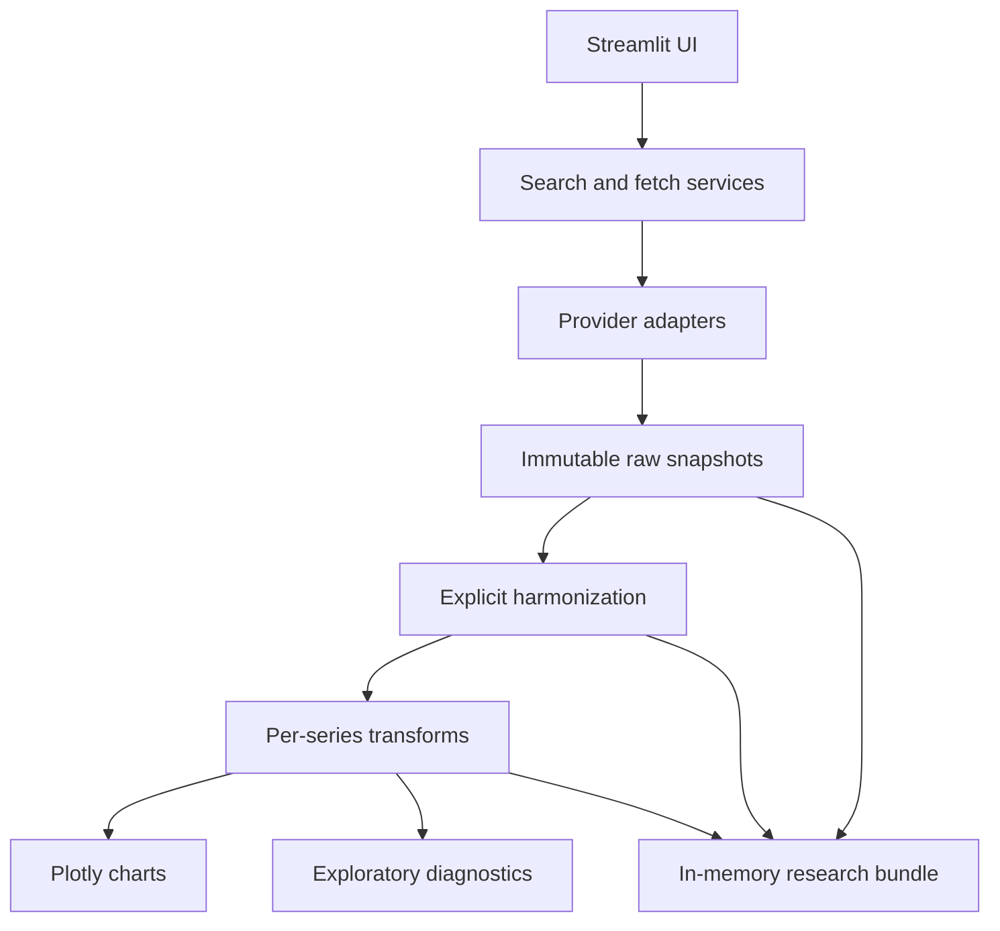

# QuickPlot

QuickPlot is a lightweight, N-series-first research workspace for economic, financial, commodity, energy, and related time series. It turns a research idea into a reproducible prepared dataset, interactive exploration, cautious diagnostics, and a provenance-rich export without requiring a database or user account.


## What it does

- Searches FRED, Yahoo Finance via yfinance, BLS CPI/PPI metadata, EIA API v2 metadata, and World Bank indicators.
- Keeps any number of raw series snapshots in session with independent visibility and transforms.
- Makes frequency, date coverage, aggregation, missing values, and upsampling explicit.
- Produces separate raw, harmonized, and analysis data layers.
- Draws large interactive Plotly overlays and aligned small multiples.
- Provides summary, Pearson/Spearman correlation, ADF/KPSS, ACF, lag scans, and rolling correlation.
- Exports an analysis CSV or an in-memory research ZIP containing configuration, provenance, raw/processed data, diagnostics, and the current chart.

## Architecture



`app.py` only composes the page. Provider parsing lives under `series_lab/providers`, processing and statistics under `series_lab/services`, figures under `series_lab/charts`, and page sections under `series_lab/ui`.

## Setup

Python 3.12 is the supported runtime.

macOS/Linux:

```bash
python3.12 -m venv .venv
source .venv/bin/activate
pip install -r requirements.txt
cp .streamlit/secrets.toml.example .streamlit/secrets.toml
streamlit run app.py
```

Windows PowerShell:

```powershell
py -3.12 -m venv .venv
.venv\Scripts\Activate.ps1
pip install -r requirements.txt
Copy-Item .streamlit\secrets.toml.example .streamlit\secrets.toml
streamlit run app.py
```

The application opens at `http://localhost:8501` by default.

## API keys and providers

| Provider | Key | Notes |
|---|---|---|
| FRED | `FRED_API_KEY` required | Official FRED API search, metadata, and observations. |
| Yahoo | none | Public yfinance Search/history functionality. This is not an official Yahoo API. |
| BLS | `BLS_API_KEY` optional | CPI/PPI search uses official lazy bulk metadata; observations use Public Data API v2. |
| EIA | `EIA_API_KEY` required | Bounded metadata traversal; facets must resolve to one value per period. |
| World Bank | none | Indicator catalog plus an explicit geography/economy selection. |

Keys may be placed in `.streamlit/secrets.toml` or the matching environment variables. Never commit `.streamlit/secrets.toml`. The app starts when keys are missing and marks only the affected providers unavailable.

The official BLS bulk-download host rejects conventional Python Requests traffic, so QuickPlot uses `curl_cffi` browser-compatible transport only for those documented catalog files. BLS observation retrieval still uses the official JSON API.

## Research workflow and data layers

1. Search selected sources and inspect candidate metadata.
2. Add resolved time series to the workspace; hide/show is distinct from removal.
3. Choose common alignment and configure each series.
4. Build the harmonized and analysis layers.
5. Explore overlay/small-multiple charts and one diagnostic view at a time.
6. Export the analysis CSV or complete research bundle.

- **Raw:** the exact provider dataframe/response snapshot retained for the session.
- **Harmonized:** aligned dates, explicit frequency and aggregation, coverage, and missing-value treatment.
- **Analysis:** independent level/log/difference/percent-change/z-score/rebase transforms. Z-scores use population standard deviation (`ddof=0`).

Upsampling never proceeds without acknowledgment. Interpolation and forward fill are labelled because they create synthetic or repeated observations.

## Lag convention and scientific limits

For target `X` and predictor candidate `Y`:

```text
lag k correlation = corr(X_t, Y_(t-k))
positive lag k = Y observed k periods before X
```

Lag scans, contemporaneous correlation, and rolling correlation are exploratory screening only. They do not establish causality or out-of-sample predictive value. V1 does not model release calendars, publication lags, real-time vintages, or historical revisions, so target-oriented diagnostics are not real-time backtests. Forecasting and automated causal claims are deliberately out of scope.

## Tests

```bash
pip install -r requirements-dev.txt
pytest -q
```

The normal suite is fully mocked/local and does not require provider credentials. It covers transformations, explicit harmonization, upsampling gates, lag sign, provider parsers, deterministic search, provider failure isolation, diagnostics, immutable raw values, and secret-safe export.

## Streamlit Community Cloud

Deploy the repository with `app.py` as the entry point, Python 3.12, and add keys in the app's Secrets settings. No Docker image, service, database, or persistent filesystem is required. Provider catalogs and responses are cached in process; the workspace itself lasts only for the Streamlit session.

## V1 limitations / roadmap

- BLS search initially covers CPI and PPI catalogs only.
- EIA search is intentionally bounded and query-guided rather than exhaustive; complex datasets may require several facet selections.
- Yahoo availability depends on yfinance and upstream public endpoints.
- Small-multiple display is capped at ten selected plots for readability, without removing workspace series.
- Authentication, persistence, forecasting, real-time vintage reconstruction, and causal inference are not V1 features.
